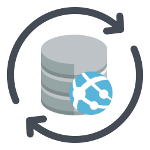

  
  
  
  
  
   
  
  

---

## What is geoip-updater?

**geoip-updater** :globe_with_meridians: keeps [MaxMind](https://www.maxmind.com/)'s GeoIP2
databases up to date. Configure the editions you need, provide your MaxMind
credentials, and let it download fresh MMDB or CSV archives on a schedule for
local use.

It is available as a [single executable]({{ config.repo_url }}releases/latest)
and a [container image](https://hub.docker.com/r/crazymax/geoip-updater/), so you
can run it on a host directly or as a containerized job in an existing stack.

## Features

* Downloads and refreshes supported GeoIP2 and GeoLite2 databases automatically
* Supports both MMDB and CSV database formats
* Runs on a configurable cron schedule without external scheduling tools
* Verifies downloaded archives before updating local database files
* Supports multiple Edition IDs in a single run

The full list of supported Edition IDs is available [here](https://github.com/crazy-max/geoip-updater/blob/master/pkg/maxmind/editionid.go).

## License

This project is licensed under the terms of the MIT license.
